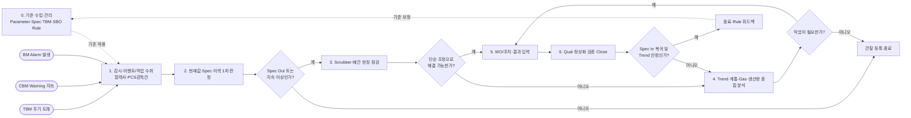

# 엔지니어 업무 흐름 현황 진단 및 TASK 세분화 보고안

> 보고 목적: Agent 설계에 착수하기 전에 현재 업무 절차, TASK별 제약, 정량화 가능 수준을 진단하고 후속 조사 범위를 합의한다.  
> 검토 근거: `엔지니어흐름.md`, `엔지니어흐름_TASK분해.md`, `pcs_agent_planning.md`, `보고서.md`  
> 수치 원칙: 확인되지 않은 시간·인력·비용은 임의 추정하지 않고 `[미측정]`으로 둔다.

---

## 1. 보고 결론

현재 자료만으로도 업무의 큰 절차는 설명할 수 있다. 인터뷰는 **기준 수립 → 감지·1차 확인 → 종합 분석 → 조치·검증**의 4개 스테이지로 정리되었고, 4개 수행 주체, 8개 시스템, 16개 TASK와 6개 GATE가 식별되었다.

다만 현재 `엔지니어흐름_TASK분해.md`는 **Agent의 Rule/Tool 설계 문서**에는 적합하지만, **팀장 보고용 업무 진단서**로는 다음 세 가지가 부족하다.

1. 여러 행동이 하나의 TASK에 묶여 있어 어느 행동에서 시간이 소요되고 문제가 발생하는지 측정하기 어렵다.
2. TASK마다 현재의 어려움은 일부만 정성적으로 기록되어 있고, 시간·투입인원·비용의 기준선은 아직 없다.
3. 기준 수립 업무와 이상 1건을 처리하는 운영 업무가 한 흐름에 섞여 있어 청중이 전체 절차를 한눈에 보기 어렵다.

따라서 팀장 보고에서는 **7단계 프로시저만 본문에 제시**하고, 진단용 부록에서는 기존 16개 복합 TASK를 **53개 측정 단위 TASK + 6개 의사결정 GATE**로 세분화하는 방식을 권고한다. 이 세분화 단위는 Agent 개수나 화면 개수를 의미하지 않으며, 현재의 낭비와 제약을 정확히 측정하기 위한 단위다.

### 현재 준비도 요약

| 진단 영역 | 현재 확보 수준 | 남은 공백 | 판정 |
|---|---|---|---|
| 업무 절차 | 4개 스테이지, 4개 주체, 8개 시스템, 16 TASK + 6 GATE 식별 | 일부 진입·회귀·권한 경로 확인 필요 | 보완 후 보고 가능 |
| TASK 세분화 | Agent 입력·출력 중심 카드 존재 | 복합 TASK가 많아 행동별 시간 측정 불가 | 세분화 필요 |
| 판단 기준 | Rule R-01~R-23, 예시값 770 torr·5분·1년 등 확보 | 미정 파라미터 10개, 현업 질문 15개 | 부분 확보 |
| 현행 불편 | 다수 파라미터 동시 확인 곤란, 일부 시스템·대상만 모니터링 가능 | 발생 빈도와 영향 규모 미측정 | 정성 확인 |
| 시간·인력·비용 | 산식과 측정 항목은 정의 가능 | TASK별 기준선 전부 미측정 | 측정 선행 필요 |
| Agent 착수 준비도 | 가치가 큰 구간은 종합 분석(T-08~G-04)으로 식별 | 데이터 접근성·커버리지·업무 기준선 미확정 | Gate 0 진행 중 |

> **보고 메시지**: “업무 흐름과 Agent 후보 영역은 찾았지만, 투자 효과를 말하려면 TASK별 현행 시간·인력·사각지대 기준선을 먼저 측정해야 합니다.”

---

## 2. 팀장 보고용 한 장 프로시저

### 2.1 한눈에 보는 운영 절차



### 2.2 프로시저 해석

| 단계 | 핵심 질문 | 주 책임 | 주요 시스템 |
|---|---|---|---|
| 0. 기준 수립·관리 | 무엇을 어떤 기준으로 감지할 것인가? | PCS기술팀 | EES(SBO 로직), G-EMS |
| 1. 감시·수취 | 어떤 설비에서 어떤 이벤트가 발생했는가? | 협력사, PCS감독관 | ACS 2.0, EES, G-EMS |
| 2. 1차 판정 | 실제 Spec Out인가, 일시적인 튐인가? | 협력사 | EES, 알람 이력 |
| 3. 현장 점검 | Leak·Parts·배관 중 어디가 이상인가? | 협력사 | 현장 측정, 체크리스트 |
| 4. 종합 분석 | 전·후단 영향과 Gas·생산 부하를 종합하면 원인은 무엇인가? | PCS기술팀 | FDC, EES, iEES, SMAS, TPSS, 계통도 |
| 5. 조치 | 어떤 범위로 작업하고 무엇을 기록해야 하는가? | Main기술팀, 협력사 | G-EMS, SOP |
| 6. 검증·종결 | 정상화되었는가, 기준을 보정해야 하는가? | PCS기술팀 | EES(SBO 로직), G-EMS |

> 화면에는 위 7단계만 보여주고, TASK ID·시스템·세부 어려움은 부록으로 넘긴다. 53개 측정 단위를 한 플로우차트에 모두 넣으면 보고 목적과 맞지 않는다.

---

## 3. 현재 문서에서 바로 보완해야 할 흐름 이슈

| # | 확인된 이슈 | 현재 영향 | 보고/문서 처리 |
|---|---|---|---|
| 1 | S1 기준 수립은 비정기 설정 업무이고 S2~S4는 케이스 운영 업무인데 한 흐름에 표시됨 | 시작점과 종료점이 복잡해 보임 | 본 흐름과 피드백 루프로 분리 |
| 2 | Daily 점검(T-05)은 상시 이벤트 수취와 다른 정기 활동인데 현재 도식상 직렬로 보임 | 모든 이벤트마다 Daily 점검을 수행하는 것으로 오해 가능 | 병렬 트랙으로 표시; 이상 시 CASE 진입 여부 확인 |
| 3 | 원문 2.1에는 협력사의 TBM 주기 확인이 있으나 TASK 카드 T-04와 흐름에서는 명확히 분리되지 않음 | TBM이 누구에게 어떻게 작업으로 전환되는지 불명확 | `M-04 TBM 도래 확인` 분리, SBO/PM 경로 확인 |
| 4 | **(확정)** SBO는 EES 내 System Based On 로직이며 자동 발행물은 WO다. Main기술팀 수동 WO와는 발행 경로만 다르다 | 잔여: 자동/수동 WO 이중 발행·중복 접수 가능성 | WO 식별자(`wo_source`) 정책 및 EES→G-EMS 연계 방식 확인 |
| 5 | G-01에 `Spec In/Out`과 `SPIKE/TREND` 두 판단이 섞여 있음 | 판정 조건과 소요시간 측정이 어려움 | G-01과 G-02로 분리 |
| 6 | 단순 조정은 T-14로 직행하지만 승인·작업지시·기록 의무가 정의되지 않음 | 무지시 작업 또는 기록 누락 위험 | 단순 조정 권한·기록 절차 확인 |
| 7 | PCS기술팀이 작업을 승인하고 Main기술팀이 WO를 발행함 | 승인 대기와 발행 대기를 구분해 측정할 수 없음 | 승인 TASK와 발행 TASK 분리 |
| 8 | 작업 후 Spec Out이면 재분석으로 회귀하나 회수·에스컬레이션 기준이 없음 | 무한 반복, 장기 미종결 케이스 가능 | 재분석 횟수와 상위 보고 기준 정의 |
| 9 | T-09 설명에서 센서 위치별 룰을 `R-09/R-10`으로 참조 | 실제 룰 `R-11/R-12`와 불일치 | 문서 참조 수정 필요 |
| 10 | 자동화 등급 분포 집계가 상세 목록과 일치하지 않음 | 자동화 비율을 경영 수치로 오해할 수 있음 | 혼합 등급 기준을 정한 뒤 재산정 |
| 11 | 상세 목록에는 G-00~G-05가 있어 실제 GATE는 6개이나 요약에는 5개로 집계됨 | 보고 수치와 도식 노드 수가 불일치 | GATE 수를 6개로 정정 |

---

## 4. TASK별 세분화 및 현재 어려움

### 4.1 불합리 코드

| 코드 | 불합리 유형 | 정의 |
|---|---|---|
| P1 | 탐색·화면 전환 | 여러 화면·시스템에서 데이터를 찾아 같은 시간축으로 맞추는 수작업 |
| P2 | 동시 가시성 부족 | 필요한 다수 파라미터·설비를 한 화면에서 동시에 비교하기 어려움 |
| P3 | 감시 사각지대 | 시스템 등록·데이터 수집·권한 범위 밖 대상은 상태 확인이 어려움 |
| P4 | 기준 미정·비표준 | 임계값, 구분 기준, 가중치 또는 기준정보가 없거나 사람마다 다름 |
| P5 | 경험 의존 판단 | 동일 데이터라도 담당자 경험에 따라 원인·우선순위가 달라질 수 있음 |
| P6 | 수기 입력·재입력 | 결과를 별도 양식이나 시스템에 다시 입력하여 누락·오류가 발생할 수 있음 |
| P7 | 인수인계·승인 대기 | 협력사·PCS·Main기술팀 사이 보고, 승인, 발행, 수취에 대기가 발생 |
| P8 | 물리 작업 제약 | 육안 확인·측정·세정·교체처럼 현장 인력이 반드시 필요한 활동 |
| P9 | 재작업·회귀 | 조치 후 미정상 또는 작업범위 누락으로 분석·작업을 반복 |
| P10 | 피드백 미축적 | 오탐·미탐·작업 결과가 구조화되지 않아 다음 기준 개선에 활용하기 어려움 |

### 4.2 기존 16개 TASK의 측정 단위 분리안

| 기존 TASK | 측정 단위로 분리할 세부 TASK | 현재 수준의 어려움 | 주 불합리 | 반드시 측정할 값 |
|---|---|---|---|---|
| T-01 Parameter·Spec 정의 | C-01 센서 목록 확보<br/>C-02 센서별 Spec 설정<br/>C-03 Warning/Alarm/EMO 등급 부여 | Model별 전체 목록 미확보, EMO 후속 경로 미정 | P4 | Model 수, Parameter 수, 누락·불일치 수, 검토 인시 |
| T-02 고장 이력·TBM 산정 | C-04 BM/WO 이력 추출<br/>C-05 고장 전 Trend 정렬·상관분석<br/>C-06 TBM 주기 확정 | G-EMS와 EES를 교차 조회해야 하며 부품별 전체 주기 미확보 | P1, P4, P5 | 부품 1종 분석시간, 참여인원, 시스템 수, 재검토 횟수 |
| T-03 SBO 로직 등록 | C-07 룰 조건 초안<br/>C-08 기존 룰 충돌·누락 검토<br/>C-09 등록·승인·버전관리 | 등록 권한, 검증 절차, 변경 이력 방식 미확인 | P4, P7, P10 | 룰 1건 등록시간, 승인 대기, 충돌·재등록 건수 |
| T-04 Warning/Alarm·자동 WO 수취 | M-01 ACS 이벤트 수신<br/>M-02 자동 WO(SBO) 목록 대조<br/>M-03 수취·담당 배정<br/>M-04 TBM 도래 확인 | **다수 파라미터 동시 확인 곤란**, ACS/EES/G-EMS 전환, 일부 시스템·대상만 감시 가능, 자동/수동 WO 중복 확인 필요 | P1, P2, P3, P7 | 대상 수, 필요/동시표시 Parameter 수, 화면전환 수, 1회 순회시간, 감시 커버리지, 미수취·중복 건수 |
| T-05 Daily 점검 | M-05 체크리스트 수행<br/>M-06 결과 기록·이상 인계 | 물리 점검과 기록이 필요하고 이상 발견 시 Case 진입 경로 미정 | P6, P7, P8 | 일 점검건수, 건당 시간·인원, 미기록률, 이상 인계시간 |
| T-06 Scrubber 현장 점검 | F-01 감지항목별 점검지시 준비<br/>F-02 Leak 확인<br/>F-03 Parts 동작 확인 | 현장 이동·측정이 필요하며 결과값의 구조화 수준 미확인 | P6, P8 | 이동/대기/실작업시간, 투입인원, 재방문율, 결과 누락률 |
| T-07 계통 점검 | F-04 Alarm별 점검구간 선택<br/>F-05 P-S/S-S/Allbypass/S-D 구간 점검 | Alarm→구간 매핑 기준과 FORELINE 범위가 불명확 | P4, P5, P8 | 점검 구간 수, 구간당 시간, 오선정·추가점검 횟수 |
| T-08 Trend 종합 분석 | A-01 대상·기간 정렬<br/>A-02 FDC 조회<br/>A-03 EES 조회<br/>A-04 iEES 조회<br/>A-05 Trend 정합성 비교 | 3개 시스템의 대상·시간축을 사람이 맞추고 다수 Trend를 비교 | P1, P2, P5 | 케이스당 조회·정렬·판단시간, 화면전환 수, 데이터 불일치율 |
| T-09 위치 영향도 분석 | A-06 센서-계통 위치 매핑<br/>A-07 전단 영향 분석<br/>A-08 후단 영향 분석 | 센서 위치 기준정보 존재 여부가 미확인이고 계통 추적이 복잡 | P1, P4, P5 | 계통 확인시간, 매핑 불가율, 재확인 인원, 원인 수정률 |
| T-10 누적 Gas 분석 | A-09 최근 PM 일자 확인<br/>A-10 Daily Gas 조회<br/>A-11 PM 이후 누적 합산 | G-EMS/SMAS 교차 조회, Gas 단위·Chamber 분해 수준, EMS 명칭 혼재 | P1, P3, P4 | 케이스당 조회·가공시간, 수기 합산 건수, 데이터 미조회율 |
| T-11 생산량·가동률 분석 | A-12 TPSS 조회<br/>A-13 부하 수준·상대순위 산정 | 비교 그룹과 부하 기준이 미정 | P1, P4, P5 | 조회시간, 비교대상 수, 기준 재판단 건수 |
| T-12 WO 발행 | W-01 작업내용 초안<br/>W-02 범위·주의사항 검토<br/>W-03 승인·발행 | PCS 승인과 Main기술팀 발행이 분리되어 있고 작업범위 누락 가능 | P6, P7, P9 | 작성시간, 승인/발행 대기, 보완 횟수, 범위 누락률 |
| T-13 WO 수취 | W-04 SBO/Main WO 통합 확인·수취 | 두 발행 경로의 중복·누락 여부 미확인 | P1, P7 | 수취 지연, 미수취·중복 건수, 확인 화면 수 |
| T-14 조치 작업 | W-05 SOP 확인<br/>W-06 조정·교체·세정 수행 | 현장 인력이 필수이며 단순 조정의 승인·기록 경로 미정 | P7, P8 | 준비/이동/작업시간, 인원, 부품·자재비, 추가작업률 |
| T-15 결과 입력·Qual | W-07 부품·결과·특이사항 입력<br/>W-08 작업 전후 데이터 첨부<br/>W-09 Qual 수행 | 수기 입력과 데이터 재첨부 가능성, Qual과 최종 검증의 경계 불명확 | P6, P7, P9 | 입력시간, 필드 누락률, 수정횟수, Qual 실패율 |
| T-16 Close·룰 튜닝 | V-02 WO Close<br/>V-04 결과 라벨링<br/>V-05 SBO 룰 피드백·튜닝 | 튜닝 필요 판단과 오탐·미탐 기록 방식이 정의되지 않음 | P4, P7, P10 | Close 대기, 미종결 건수, 피드백 기록률, 룰 재발률 |

### 4.3 의사결정 GATE의 분리안

| GATE | 선행 측정 TASK | 판단 | 현재 어려움 | 측정할 값 |
|---|---|---|---|---|
| G-00 이벤트/Case 생성 | 시스템 스트림 | TBM/CBM/BM/EMO 진입 여부 | TBM의 SBO 여부, EMO 경로 미정 | 트리거별 건수, 미생성·중복 Case 수 |
| G-01 Spec 판정 | D-01 현재 압력·온도 조회, D-02 적용 Spec 매핑 | Spec In/Out | Model별 전체 Spec 미확보 | 판정시간, Spec 미매핑률, 판정 수정률 |
| G-02 지속성 판정 | D-03 알람 이력·빈도 조회 | SPIKE/TREND | 빈도 높음/낮음의 정량 경계 미정 | 판정시간, 관찰 후 재발률, 오탐률 |
| G-03 현장 작업 분류 | F-06 점검 결과 구조화, F-07 PCS 보고·인계 | 단순 조정/정밀 작업 | 점검 결과 조합별 기준 미정 | 판단시간, 보고·인계시간, PCS 재판정률, 분류 변경률 |
| G-04 원인 진단 | Gas·압력·수명 데이터 | 수명 도래/배관 막힘/센서포트 막힘 | 압력 급상승과 사용량 대비 압력의 정량 기준 미정 | 진단시간, 현장 결과 일치율, 원인 수정률 |
| G-05 작업 필요·우선순위 | A-14 Gas·생산량·Trend 근거 통합 | 작업 필요/불요·우선순위 | 가중치·승인 기준 미정 | 승인시간, 보류·반려율, 우선순위 역전 건수 |
| G-06 정상화 검증 | V-01 작업 후 Trend 조회, V-03 재분석·에스컬레이션 | Spec In+안정/재분석 | 안정 관찰기간, 반복 상한·에스컬레이션 미정 | 검증시간, 재분석률, 재작업률, 재발률 |

---

## 5. 불합리를 시간·인력·비용으로 환산하는 기준

### 5.1 TASK 단위 공통 산식

TASK마다 아래 값을 수집하면 동일 기준으로 비교할 수 있다.

| 구분 | 기호 | 정의 |
|---|---|---|
| 월 수행횟수 | `N` | 한 달 동안 해당 TASK가 실행된 횟수 |
| 평균 실작업시간 | `T` | 사람이 화면을 조작·판단·입력·작업한 평균 분 |
| 평균 투입인원 | `P` | 동시에 또는 순차적으로 실제 투입된 인원 |
| 재작업률 | `R` | 동일 TASK를 오류·누락 때문에 다시 수행한 비율 |
| 평균 재작업시간 | `Tr` | 재작업 1건의 평균 분 |
| 표준 월 가용시간 | `Hstd` | 사내 FTE 환산 기준 시간 |
| 직무별 시간당 총인건비 | `C` | 급여뿐 아니라 사내 기준에 따른 부대비용을 포함한 시간당 비용 |

```text
월 기본 인시 = N × T × P ÷ 60
월 재작업 인시 = N × R × Tr × P ÷ 60
월 총 인시 = 월 기본 인시 + 월 재작업 인시
FTE 환산 = 월 총 인시 ÷ Hstd
월 인건비 = Σ(직무별 투입시간 × 직무별 시간당 총인건비)
```

대기시간은 사람이 실제로 붙잡혀 있는 시간과 시스템·승인 완료를 기다리는 경과시간을 구분한다. **경과 대기시간 전체를 인건비로 계산하지 않는다.** 대신 리드타임과 사고 노출시간으로 별도 보고한다.

### 5.2 감시 업무 전용 지표

| 지표 | 산식 | 의미 |
|---|---|---|
| 감시 커버리지 | `현재 상태 확인 가능 대상 수 ÷ 전체 관리 대상 수 × 100` | 시스템 제약으로 인한 사각지대 규모 |
| 데이터 가용률 | `정상 데이터 수집 대상 수 ÷ 등록 대상 수 × 100` | 등록은 되었지만 데이터가 없는 대상 분리 |
| 동시 가시성 비율 | `한 화면 동시 표시 가능 Parameter 수 ÷ 판단에 필요한 Parameter 수 × 100` | 다중 Parameter 확인 제약 |
| 1회 감시 순회시간 | 한 명이 지정 범위 전체를 확인하는 실측 분 | 반복 감시 인시 계산의 기준 |
| 화면 전환 부담 | 케이스 또는 순회 1회당 시스템·화면 전환 횟수 | 탐색 낭비의 대리지표 |
| 미탐·지연 건수 | 사후 이상이 확인됐으나 감시 단계에서 잡히지 않은 건수 | 사각지대의 실제 결과 |

### 5.3 사고·생산 Loss 환산

```text
연간 기대 Loss = 연간 관련 사고 건수 × 사고 1건당 평균 실제 Loss
Agent 적용 가능 예방가치 = 연간 기대 Loss × 사전감지 가능 비율 × 예방 성공률
```

- 사고 1건당 Loss에는 사내 재무 기준으로 인정되는 생산중단, 제품손실, 긴급복구, 부품·외주비만 포함한다.
- “Agent가 있었다면 막았을 것”이라는 가정은 현업·품질·재무가 사고별로 판정해야 한다.
- 인건비 절감과 생산 Loss 예방은 서로 다른 효과이므로 합산 시 중복 계산 여부를 확인한다.

### 5.4 Scrubber 모니터링 불합리의 보고 문장 템플릿

다음 빈칸을 실측값으로 채우면 사용자께서 제시한 불편을 경영 수치로 바꿀 수 있다.

> 협력사는 Scrubber **[전체 대상 N대]**를 관리하지만 현재 애플리케이션에서 상태 확인 가능한 대상은 **[M대]**로, 감시 커버리지는 **[M/N×100%]**이다. 이상 판정에는 설비당 **[K개]** Parameter가 필요하나 한 화면에서 동시에 볼 수 있는 값은 **[k개]**여서, 1회 감시 때 평균 **[화면 전환 S회]**, **[T분]**, **[P명]**이 투입된다. 월 **[R회]** 순회 기준 **[R×T×P/60 인시]**, **[인건비 원]**이며, 시스템 밖 또는 데이터 미발생 대상 **[N-M대]**는 별도 수기 점검 또는 감시 사각지대로 남는다.

---

## 6. 기존 보고서 수치 사용 시 주의

| 기존 표현 | 현재 해석 | 팀장 보고 전 조치 |
|---|---|---|
| 관리 설비 약 15만 대 | 전체 PCS 관리규모인지, 이번 Scrubber 범위인지 분모가 불명확 | 라인·설비군별 이번 과제 모집단 확정 |
| 감시·조회 AI 전환율 70% | 목표치이며 현재 TASK별 시간 기준선이 없음 | 자동화 가능 TASK 인시 ÷ 전체 감시·조회 인시로 정의 |
| 데이터 조회시간 70% 감소 | 목표치이며 현재 평균 조회시간이 없음 | A-01~A-13의 케이스당 시간 실측 |
| 점검 후보 선정시간 50% 감소 | 목표치이며 시작·종료 시점 정의가 없음 | 이벤트 수취부터 G-05 승인까지 리드타임으로 정의 |
| 작업요청 누락 0건 | 목표는 명확하나 현재 누락 건수와 자동(SBO)/수동 WO 중복 기준이 없음 | 최근 이력 기준 누락·중복 baseline 산출 |

위 값은 삭제할 필요는 없지만, 현시점에서는 **실적 또는 확정 효과가 아니라 목표 가설**로 표기해야 한다.

---

## 7. 2주 내 현황 정량화 실행안

| 시점 | 활동 | 산출물 | 담당 제안 |
|---|---|---|---|
| 1일차 | 대상 라인·Scrubber·Parameter·시스템 범위 확정 | 감시 모집단과 커버리지 분모 | PCS기술팀, 협력사 |
| 1~5일차 | M-01~G-06의 수행횟수·실작업시간·대기시간·인원 표본 기록 | TASK별 Time & Motion 원시자료 | 실제 수행자 |
| 병행 | 최근 3개월 Alarm/자동 WO(SBO)/수동 WO/작업결과 로그 추출 | 월 발생량, 미수취·중복·재작업·재발 기준선 | 시스템 담당 |
| 6~7일차 | 시스템 등록·데이터 발생 여부 전수 대조 | 감시 커버리지, 데이터 가용률, 사각지대 목록 | 시스템 담당, 협력사 |
| 8~9일차 | 직무별 인건비와 사고 1건당 Loss 기준 협의 | 인건비·Loss 환산 기준 | 팀장, 재무/생산 관련 부서 |
| 10일차 | TASK별 월 인시·FTE·비용·Risk 산출 및 상위 불합리 선정 | As-Is 정량 진단표, Agent 우선순위 | PCS기술팀 |

측정 결과는 아래 네 가지 순서로 정렬한다.

1. 월 인시가 큰 반복 업무
2. 감시 커버리지가 낮아 미탐 위험이 큰 업무
3. 승인·인수인계 대기로 전체 리드타임을 늘리는 업무
4. 기준이 미정이라 Agent 자동판정이 불가능한 업무

---

## 8. Agent 착수 전 팀장 의사결정 요청사항

1. Agent 개발 이전에 **2주간 As-Is 기준선 측정**을 선행하는 방안 승인
2. 이번 과제의 감시 모집단을 전체 PCS 설비가 아닌 **대상 라인·Scrubber·Parameter 기준으로 명시**
3. 협력사, PCS기술팀, Main기술팀, 시스템 담당자별 측정·확인 책임자 지정
4. (확정: SBO 발행물 = WO) 자동/수동 WO 식별·중복 정책, 단순 조정 권한, EMO·TBM 경로를 우선 확정
5. 기준선 확인 후 월 인시·커버리지·미탐 Risk가 큰 TASK부터 Agent 적용 범위 선정

### 1분 보고 문안

> 인터뷰를 기준으로 현재 업무를 기준 수립, 감지·1차 확인, 종합 분석, 조치·검증의 네 단계로 정리했고, 16개 TASK와 6개 판단 지점을 확인했습니다. Agent 설계의 뼈대는 확보됐습니다. 다만 현재 TASK에는 여러 행동이 묶여 있어 어디에서 시간과 인력이 낭비되는지 바로 계산할 수 없습니다. 특히 협력사 모니터링은 다수 Parameter를 동시에 보기 어렵고 일부 시스템·대상만 확인할 수 있어, 화면 전환에 드는 시간과 감시 사각지대 규모를 먼저 측정해야 합니다. 보고 화면은 7단계 프로시저로 단순화하고, 내부 측정은 53개 행동 단위로 나누겠습니다. 2주 동안 수행시간, 인원, 감시 커버리지, 누락·재작업을 측정한 뒤 월 인시·FTE·비용과 사고 Risk로 환산하여 Agent 우선 적용 TASK를 보고드리겠습니다.
